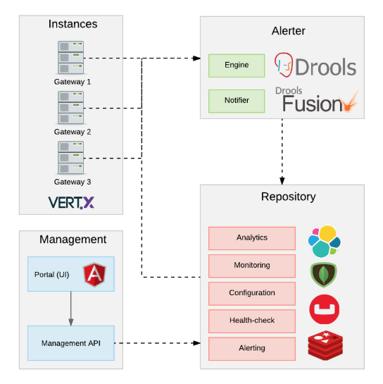

# Gravitee.io on top of Kubernetes

This repository has the intention to host scripts to easy the task of deploying [Gravitee.io](https://gravitee.io) stack and its dependencies on top of [Kubernetes](https://kubernetes.io) with different cloud providers (Google's GKE, Amazon's AWS, Microsoft's Azure) or on-premises.

I tried as much as I could, to follow best practices for clusters creation and distributed computing but this is an ongoing effort in an attempt to create "production-grade" deployment scripts. If you spot areas of improvement or room for additional features, please share with the community or submit a merge request adding your contributions.

Gravitee
[Gravitee.io](https://gravitee.io) is made of [3 major components:](https://docs.gravitee.io/apim_overview_components.html)



_**quoting Gravitee's website_**
- Gateway
    - The gateway is the core component of the Gravitee.io platform. You can compare it to a "smart" proxy to understand its goal. Unlike traditional HTTP proxy, the gateway is able to apply policies (ie. rules) to both HTTP requests and responses according to your needs, meaning that you can enhance requests and responses processing by adding transformation, security, and many more features!
- Management API
    - A restful API providing a bunch of services to manage and configure the global platform. All exposed services are secured by authentication and authorization rules.
- UI
    - This is the Web UI for Gravitee.io Management API. The UI acts as a management tool for API Publishers but also as a portal for your API Consumers.

Both Gateway and Management API relies on Repositories and Reporteres
- **Repositories** are pluggable storage components for APIs configuration, policies configurations, analytics and so on.
    - "Out of the box", the default repository is [MongoDB](https://www.mongodb.com/)
- **Reporters** are used by gateway instances to report many types of events:
    - Requests/responses metrics : response-time, content-length, api-key, …​
    - Monitoring metrics: CPU, Heap usage, …​
    - Health-check metrics: status, response code
    - "Out of the box" reporters are :
        - [Elasticsearch](https://www.elastic.co/) Reporter
        - File Reporter

## Structure

Each major component or dependency has its own directory to host script for different environment/cloud provider. 
To reflect the aforementioned structure, the repository is organized as:

```
README.md
deploy-to-gke.sh
deploy-to-ake.sh
...
Elasticsearch
└───GKE
│   └───Elasticsearch
|   |    |   README.md
|   |    |   deploy.sh
└───AWS
|   └───...
Gravitee
└───GKE
│   └───Gateway
│   |   │   deploy.sh
│   └───Management-API
│   |   │   deploy.sh
│   └───Portal
│   |   │   deploy.sh
└───AWS
|   └───...
MongoDB
└───GKE
│   └───Elasticsearch
|   |    |   README.md
|   |    |   deploy.sh
│   ...
```

## Deployment
To deploy targeting a specific cloud provider, all you have to do is to invoke from your terminal, the specific shell script for the desired provider.

### Prerequisites
1. If you are deploying to a clould provider, we assume you have an account created and their CLI (all of them offer CLI and this is how the deployment is automated with the scripts in this repository) and also Kubernetes command tool (“kubectl”)
2. If deploying "on-premises", make sure the Kubernetes command tool (“kubectl”) is installed.

> Example 1:
>> As a Google Cloud customer, I want to deploy Gravitee stack and its dependencies to GKE (Googke Kubernetes Engine).
First thing I have to populate the required script variable values:
# Input variables
## For MongoDB
```shell
$ export MONGO_ROOT_USER=main_admin
$ export MONGO_ROOT_PASSWORD=abc123
$ export MONGO_DEFAULT_REGION_ZONE=us-central1-a
$ export MONGO_CLUSTER_NAME=gke-mongodb-cluster
```
## For Elasticsearch
```
$ export ELASTIC_DEFAULT_REGION_ZONE=us-east4-a
$ export ELASTIC_CLUSTER_NAME=gke-elasticsearch-cluster
```

## For Gravitee
```
$ export GRAVITEE_DEFAULT_REGION_ZONE=us-west1-a
$ export GRAVITEE_CLUSTER_NAME=apim-gravitee-cluster
$ export GRAVITEE_MONGO_DBNAME=gravitee
$ export GRAVITEE_MONGO_USERNAME=gravitee
$ export GRAVITEE_MONGO_PASSWORD=gravitee123
```

### For Gravitee Gateway
```
$ export GRAVITEE_GATEWAY_REPLICAS_QTY=2
```

### For Gravitee Management API
```
$ export GRAVITEE_MANAGEMENT_REPLICAS_QTY=1
```

### For Gravitee Portal
```
$ export GRAVITEE_PORTAL_REPLICAS_QTY=2
```

# Output variables
## For MongoDB
```shell
echo $MONGO_HOST
echo $MONGO_PORT
```
## For Elasticsearch
```shell
echo $ELASTIC_HOST
echo $ELASTIC_PORT
```

## For Gravitee
### Gravitee Gateway
```shell
echo $GRAVITEE_GATEWAY_HOST
echo $GRAVITEE_GATEWAY_PORT
```

### Gravitee Management API
```shell
echo $GRAVITEE_MANAGEMENT_HOST
echo $GRAVITEE_MANAGEMENT_PORT
```

### Gravitee Portal (UI)
```shell
echo $GRAVITEE_UI_HOST
echo $GRAVITEE_UI_PORT
```

# Then I can invoke the script:
```shell
$ sh deploy-to-gke.sh
```


# TO DO:
- Update [Gravitee/GKE/Portal/deploy.sh](Gravitee/GKE/Portal/deploy.sh) to replace default Management API endpoint in the constants.json file inside the UI's docker container. (Suggest Gravitee's team to pass this as env variable during the container creation).
- Prompt user to provide variable values when invoking the shell script
- Add deployment/scripts for AWS
- Add deployment/scripts for AKS
- Add deployment/scripts for on-premises
